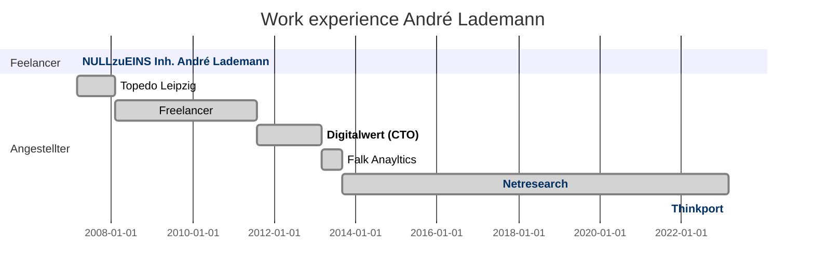

# Hi there, I'm André - aka [vergissberlin][website] 👋

## I'm a father, developer, and teacher!

- 🌱 I’m currently dive into cloud architechture.
- 👯 I’m looking to collaborate with other developers and ux experts.
- 🥅 2023 goals: Take hands on Clojure and Rust.
- ⚡ Fun fact: I love to fly drones and IoT!

<!--

-->

---

### Connect with me

[][website]
[][youtube]
[][twitter]
[][linkedin]

---

### 📊 This week I spent my time on

<!--START_SECTION:waka-->

```text
PHP              1 hr 4 mins     ███████▒░░░░░░░░░░░░░░░░░   29.06 %
HTML             44 mins         █████░░░░░░░░░░░░░░░░░░░░   19.89 %
YAML             32 mins         ███▓░░░░░░░░░░░░░░░░░░░░░   14.55 %
JSON             19 mins         ██▒░░░░░░░░░░░░░░░░░░░░░░   08.76 %
Other            17 mins         ██░░░░░░░░░░░░░░░░░░░░░░░   07.69 %
```

<!--END_SECTION:waka-->

<!-- START_SECTION:codestats -->
<!-- END_SECTION:codestats -->

<!--
### Skill overview

[](https://codestats.net/users/vergissberlin)

[](https://codestats.net/users/vergissberlin)

[More details](https://codestats.net/users/vergissberlin)
-->

---

### 📺 Latest YouTube Videos
<!-- YOUTUBE:START -->
- [Wissensmanagement mit Obsidian](https://www.youtube.com/watch?v=NCIzKtO5chA)
- [TYPO3 vs Wordpress – Login, Nutzerverwaltung und das Rechtesystem](https://www.youtube.com/watch?v=dHiqvumfEzc)
- [Softwareentwickler / Programmierer](https://www.youtube.com/watch?v=cSDDq-QNq0I)
<!-- YOUTUBE:END -->

---

### 📕 Latest Blog Posts

#### Medium

<!-- MEDIUM:START -->
- [Generate gigabytes of test data with JavaScript in high speed](https://medium.com/netresearch/generate-gigabytes-of-test-data-with-javascript-in-high-speed-98b990967824?source=rss-25031e672016------2)
- [Continuous delivery with Docker](https://medium.com/@andre.lademann/continuous-delivery-with-docker-91e3ed8188ad?source=rss-25031e672016------2)
- [Release notes for Docker - dockerized applications and its services](https://medium.com/blugento/release-notes-for-docker-dockerized-applications-and-its-services-4c92b254ab2?source=rss-25031e672016------2)
- [Reverse proxies and CDN as a service for Magento](https://medium.com/blugento/reverse-proxies-and-cdn-as-a-service-for-magento-4b0ad0d77b1?source=rss-25031e672016------2)
<!-- MEDIUM:END -->

#### Hashnode

<!-- HASHNODE:START -->
- [Custom ChatGPT with OpenAI API](https://blog.andrelademann.de/custom-chatgpt-with-openai-api)
- [Custom fake data generator](https://blog.andrelademann.de/custom-fake-data-generator)
- [Gamification has a lot of potential for companies!](https://blog.andrelademann.de/gamification-has-a-lot-of-potential-for-companies)
- [Using MJML to improve your email in Node-RED](https://blog.andrelademann.de/using-mjml-to-improve-your-email-in-node-red)
- [Benchmark - What is the quickest way to copy files?](https://blog.andrelademann.de/benchmark-what-is-the-quickest-way-to-copy-files)
<!-- HASHNODE:END -->

#### Stack Overflow

<!-- STACKOVERFLOW:START -->
- [Answer by André Lademann for It is possible to login the user into chrome extension using the local storage of our website?](https://stackoverflow.com/questions/68436609/it-is-possible-to-login-the-user-into-chrome-extension-using-the-local-storage-o/68436704#68436704)
<!-- STACKOVERFLOW:END -->

#### TTN LoRaWAN network Leipzig

- [Warum eigentlich LoRa in Leipzig?](https://www.thethingsnetwork.org/community/leipzig/post/warum-eigentlich-lora-in-leipzig)
- [Digitalisierung der Stadt Leipzig - Zukunftsaussichten aus dem Jahre 2020](https://www.thethingsnetwork.org/community/leipzig/post/digitalisierung-der-stadt-leipzig-zukunftsaussichten-aus-dem-jahre-2020)
- [Smart Cities - Let's begin!](https://www.thethingsnetwork.org/community/leipzig/post/smart-cities-lets-begin-join-the-ttn-meetup-in-leipzig)

## Work experience



---


[website]: https://andrelademann.de
[twitter]: https://twitter.com/vergissberlin
[youtube]: https://youtube.com/vergissberlin
[linkedin]: https://linkedin.com/in/andre-lademann/

---

[](https://codestats.net/users/vergissberlin)
