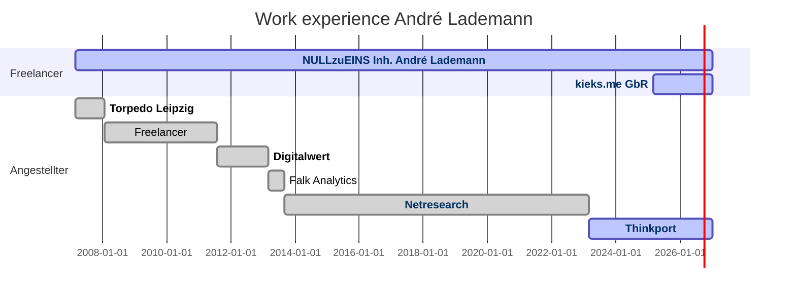

# Hi there, I'm André - aka [vergissberlin][website] 👋

## I'm a father, developer, and consultant! 

- 🌱 I am currently immersing myself in the depths of Observability. 
- 👯 I'm looking to collaborate. 
- 🥅 2026 goals: Grow with kieks.me GbR and improve skills on AI and Observability.
- ⚡ Fun fact: [Sigmund Jähn](https://de.wikipedia.org/wiki/Sigmund_J%C3%A4hn) was my neighbor!

---

🌧️ **I'm a Senior Cloud Engineer** having expertise in

[](#)
[](#)
[](#)
[](#)
[](#)

📀 **With Hands on** experience working with data stores like

[](#)
[](#)
[](#)
[](#)
[](#)

📚 **Frameworks** I've worked with

[](#)
[](#)
[](#)
[](#)
[](#)

<!--
[](#) 
-->

🔭 And some **useful tools** like

[](#)
[](#)
[](#)
[](#)
[](#)
[](#)
[](#)
[](#)
[](#)
[](#)

📦 Checkout some of **my packages** published on

[](https://github.com/vergissberlin?tab=packages)
[](https://www.npmjs.com/~vergissberlin)

<!--

-->

---

### 💁‍♂️ Connect with me

[][website]
[][youtube]
[][twitter]
[][linkedin]

---

### 📊 This week I spent my time on

[](https://wakatime.com/@e47700b1-b714-4086-acd9-7979081706dc)

<!--START_SECTION:waka-->

```txt
Other        24 hrs 59 mins  ███████████████████████░░   91.55 %
YAML         32 mins         ▒░░░░░░░░░░░░░░░░░░░░░░░░   01.99 %
Markdown     32 mins         ▒░░░░░░░░░░░░░░░░░░░░░░░░   01.98 %
Bash         26 mins         ▒░░░░░░░░░░░░░░░░░░░░░░░░   01.59 %
Git Config   23 mins         ▒░░░░░░░░░░░░░░░░░░░░░░░░   01.42 %
```

<!--END_SECTION:waka-->

<!-- START_SECTION:codestats -->
<!-- END_SECTION:codestats -->

<!--
### Skill overview

[](https://codestats.net/users/vergissberlin)

[](https://codestats.net/users/vergissberlin)

[More details](https://codestats.net/users/vergissberlin)
-->

---

### 📺 Latest YouTube Videos
<!-- YOUTUBE:START -->
- [Wissensmanagement mit Obsidian](https://www.youtube.com/watch?v=NCIzKtO5chA)
- [TYPO3 vs Wordpress – Login, Nutzerverwaltung und das Rechtesystem](https://www.youtube.com/watch?v=dHiqvumfEzc)
- [Softwareentwickler / Programmierer](https://www.youtube.com/watch?v=cSDDq-QNq0I)
<!-- YOUTUBE:END -->

---

### 📕 Latest Blog Posts

#### Medium

<!-- MEDIUM:START -->
- [Generate gigabytes of test data with JavaScript in high speed](https://medium.com/netresearch/generate-gigabytes-of-test-data-with-javascript-in-high-speed-98b990967824?source=rss-25031e672016------2)
- [Continuous delivery with Docker](https://medium.com/@andre.lademann/continuous-delivery-with-docker-91e3ed8188ad?source=rss-25031e672016------2)
- [Release notes for Docker - dockerized applications and its services](https://medium.com/blugento/release-notes-for-docker-dockerized-applications-and-its-services-4c92b254ab2?source=rss-25031e672016------2)
- [Reverse proxies and CDN as a service for Magento](https://medium.com/blugento/reverse-proxies-and-cdn-as-a-service-for-magento-4b0ad0d77b1?source=rss-25031e672016------2)
<!-- MEDIUM:END -->

#### [Personal blog][blog]

<!-- HASHNODE:START -->
- [Let&#39;s get serial](https://blog.andrelademann.de/lets-get-serial)
- [What is pubspec.lock for](https://blog.andrelademann.de/what-is-pubspeclock-for)
- [Custom ChatGPT with OpenAI API](https://blog.andrelademann.de/custom-chatgpt-with-openai-api)
- [Custom fake data generator](https://blog.andrelademann.de/custom-fake-data-generator)
- [Gamification has a lot of potential for companies! ](https://blog.andrelademann.de/gamification-has-a-lot-of-potential-for-companies)
<!-- HASHNODE:END -->

#### Stack Overflow

<!-- STACKOVERFLOW:START -->
- [Answer by André Lademann for It is possible to login the user into chrome extension using the local storage of our website?](https://stackoverflow.com/questions/68436609/it-is-possible-to-login-the-user-into-chrome-extension-using-the-local-storage-o/68436704#68436704)
<!-- STACKOVERFLOW:END -->

#### TTN LoRaWAN network Leipzig

<!-- TTN:START -->
- [#037 Bastelrunde - LoRaWAN-Plattform skalierbar &amp; datenschutzkonform bauen](https://www.thethingsnetwork.org/community/leipzig/post/037-bastelrunde-lorawan-plattform-skalierbar-datenschutzkonform-bauen)
- [#033 Bastelrunde - Admin-Dashboard für das Regenfass-Projekt](https://www.thethingsnetwork.org/community/leipzig/post/033-bastelrunde-admin-dashboard-f%C3%BCr-das-regenfass-projekt)
- [#032 Bastelrunde - Event Driven Development](https://www.thethingsnetwork.org/community/leipzig/post/032-bastelrunde-event-driven-development)
- [#031 Bastelrunde - Design System](https://www.thethingsnetwork.org/community/leipzig/post/031-bastelrunde-design-system)
- [#030 Bastelrunde - Datenschutz und Datensicherheit in OpenSource Projekten](https://www.thethingsnetwork.org/community/leipzig/post/030-bastelrunde-datenschutz-und-datensicherheit-in-opensource-projekten)
<!-- TTN:END -->
<!--
The TTN community page has no native feed. The RSS URL in
.github/workflows/readme-feeds.yml is generated by fetchrss.com; an alternative
generator is https://createfeed.fivefilters.org/ with:
  url=https://www.thethingsnetwork.org/community/leipzig/posts
  in_id_or_class=widget-card-story
-->

## Work experience


```mermaid
gantt
	dateFormat YYYY-MM-DD
	title      Work experience André Lademann

	section Freelancer 
		NULLzuEINS Inh. André Lademann :active,  nze, 2007-03, 2026-12-31
		kieks.me GbR  :active,  kieksme, 2025-03-01, 2026-12-31
		click nze href "https://nullzueins.com"
		click kieksme href "https://kieks.me"
	
	section Angestellter
		Torpedo Leipzig : done, emp1, 2007-03-01, 2008-02-01
		Freelancer      :done, emp2, after emp1, 2011-08-01
		Digitalwert     :done, emp3, after emp2, 2013-03-01
		Falk Analytics  : done, emp4, after emp3, 2013-09-01
		Netresearch     : done, emp5, after emp4, 2023-02-28
		Thinkport       :active, emp6, after emp5, 2026-12-31

		click emp1 href "https://torpedo-motor.com"
		click emp3 href "https://digitalwert.de"
		click emp5 href "https://netresearch.de"
		click emp6 href "https://thinkport.digital"
```

---

## GitHub activity

<!--
Replaces the previous github-readme-stats.vercel.app card. That project's shared
public instance runs on one rate-limited GitHub token and answers "Maximum
retries exceeded" for a good part of the day, which is why the card at the bottom
of this profile was usually broken.

Both hosts below are addressed with a `<picture>` per card, so the theme follows
the reader's `prefers-color-scheme` (GitHub swaps the `<source>` itself).

If either host turns flaky too, the summary cards can be pre-generated instead:
the upstream Action `vn7n24fzkq/github-profile-summary-cards` writes the same
five SVGs into a branch, which are then embedded from raw.githubusercontent.com
with no third-party render at page load. See docs/automation.md.
-->

<p align="center">
  <picture>
    <source media="(prefers-color-scheme: dark)" srcset="https://github-profile-summary-cards.vercel.app/api/cards/profile-details?username=vergissberlin&amp;theme=github_dark" />
    
  </picture>
</p>

<p align="center">
  <picture>
    <source media="(prefers-color-scheme: dark)" srcset="https://github-profile-summary-cards.vercel.app/api/cards/repos-per-language?username=vergissberlin&amp;theme=github_dark" />
    
  </picture>
  <picture>
    <source media="(prefers-color-scheme: dark)" srcset="https://github-profile-summary-cards.vercel.app/api/cards/most-commit-language?username=vergissberlin&amp;theme=github_dark" />
    
  </picture>
</p>

<p align="center">
  <picture>
    <source media="(prefers-color-scheme: dark)" srcset="https://github-profile-summary-cards.vercel.app/api/cards/stats?username=vergissberlin&amp;theme=github_dark" />
    
  </picture>
  <picture>
    <!-- utcOffset is static: 2 = CEST, the offset in effect for ~7 months a year in Leipzig. -->
    <source media="(prefers-color-scheme: dark)" srcset="https://github-profile-summary-cards.vercel.app/api/cards/productive-time?username=vergissberlin&amp;theme=github_dark&amp;utcOffset=2" />
    
  </picture>
</p>

<p align="center">
  <picture>
    <source media="(prefers-color-scheme: dark)" srcset="https://github-profile-trophy.vercel.app/?username=vergissberlin&amp;theme=gitdimmed&amp;no-frame=true&amp;column=6&amp;margin-w=8&amp;margin-h=8" />
    
  </picture>
</p>

[website]: https://andrelademann.de
[blog]: https://blog.andrelademann.de
[twitter]: https://x.com/vergissberlin
[youtube]: https://youtube.com/vergissberlin
[linkedin]: https://linkedin.com/in/andre-lademann/
