# Hi there, I'm André - aka [vergissberlin][website] 👋

## I'm a father, developer, and teacher!

- 🌱 I am currently immersing myself in the depths of LoRaWAN.
- 👯 I’m looking to collaborate with other developers and ux experts.
- 🥅 2024 goals: Improve skills on Dart and Azure.
- ⚡ Fun fact: [Siegmud Jähn](https://de.wikipedia.org/wiki/Sigmund_J%C3%A4hn) was my neighbor!

---

🌧️ **I'm a Senior Cloud Engineer** having expertise in

[](#)
[](#)
[](#)
[](#)

📀 **With Hands on** experience working with data stores like

[](#)
[](#)
[](#)
[](#)
[](#)
[](#)

📚 **Frameworks** I've worked with

[](#)
[](#)
[](#)
[](#)
[](#)

<!--
[](#) 
-->

🔭 And some **useful tools** like

[](#)
[](#)
[](#)
[](#)
[](#) 

<!--
-->


📦 Checkout some of **my packages** published on

[](https://github.com/vergissberlin?tab=packages)
[](https://www.npmjs.com/~vergissberlin)

<!--

-->

---

### 💁‍♂️ Connect with me

[][website]
[][youtube]
[][twitter]
[][linkedin]

---

### 📊 This week I spent my time on

<!--START_SECTION:waka-->

```txt
Other                         24 hrs 11 mins  ██████████████▓░░░░░░░░░░   58.13 %
Dart                          7 hrs 17 mins   ████▒░░░░░░░░░░░░░░░░░░░░   17.54 %
YAML                          3 hrs 45 mins   ██▒░░░░░░░░░░░░░░░░░░░░░░   09.02 %
Markdown                      2 hrs 17 mins   █▒░░░░░░░░░░░░░░░░░░░░░░░   05.50 %
JSON                          1 hr 58 mins    █▒░░░░░░░░░░░░░░░░░░░░░░░   04.74 %
```

<!--END_SECTION:waka-->

<!-- START_SECTION:codestats -->
<!-- END_SECTION:codestats -->

<!--
### Skill overview

[](https://codestats.net/users/vergissberlin)

[](https://codestats.net/users/vergissberlin)

[More details](https://codestats.net/users/vergissberlin)
-->

---

### 📺 Latest YouTube Videos
<!-- YOUTUBE:START -->
- [Wissensmanagement mit Obsidian](https://www.youtube.com/watch?v=NCIzKtO5chA)
- [TYPO3 vs Wordpress – Login, Nutzerverwaltung und das Rechtesystem](https://www.youtube.com/watch?v=dHiqvumfEzc)
- [Softwareentwickler / Programmierer](https://www.youtube.com/watch?v=cSDDq-QNq0I)
<!-- YOUTUBE:END -->

---

### 📕 Latest Blog Posts

#### Medium

<!-- MEDIUM:START -->
- [Generate gigabytes of test data with JavaScript in high speed](https://medium.com/netresearch/generate-gigabytes-of-test-data-with-javascript-in-high-speed-98b990967824?source=rss-25031e672016------2)
- [Continuous delivery with Docker](https://medium.com/@andre.lademann/continuous-delivery-with-docker-91e3ed8188ad?source=rss-25031e672016------2)
- [Release notes for Docker - dockerized applications and its services](https://medium.com/blugento/release-notes-for-docker-dockerized-applications-and-its-services-4c92b254ab2?source=rss-25031e672016------2)
- [Reverse proxies and CDN as a service for Magento](https://medium.com/blugento/reverse-proxies-and-cdn-as-a-service-for-magento-4b0ad0d77b1?source=rss-25031e672016------2)
<!-- MEDIUM:END -->

#### Hashnode

<!-- HASHNODE:START -->
- [What is pubspec.lock for](https://blog.andrelademann.de/what-is-pubspeclock-for)
- [Custom ChatGPT with OpenAI API](https://blog.andrelademann.de/custom-chatgpt-with-openai-api)
- [Custom fake data generator](https://blog.andrelademann.de/custom-fake-data-generator)
- [Gamification has a lot of potential for companies!](https://blog.andrelademann.de/gamification-has-a-lot-of-potential-for-companies)
- [Using MJML to improve your email in Node-RED](https://blog.andrelademann.de/using-mjml-to-improve-your-email-in-node-red)
<!-- HASHNODE:END -->

#### Stack Overflow

<!-- STACKOVERFLOW:START -->
- [Answer by André Lademann for It is possible to login the user into chrome extension using the local storage of our website?](https://stackoverflow.com/questions/68436609/it-is-possible-to-login-the-user-into-chrome-extension-using-the-local-storage-o/68436704#68436704)
<!-- STACKOVERFLOW:END -->

#### TTN LoRaWAN network Leipzig

<!-- TTN:START -->
- [#013 Bastelrunde - Arduino über eine Webseite installieren und Konfigurieren](https://www.thethingsnetwork.org/community/leipzig/post/013-bastelrunde-arduino-%C3%BCber-eine-webseite-installieren-und-konfigurieren)
- [#012 Bastelrunde - GitHub Actions zur automatischen Erstellung von Binaries](https://www.thethingsnetwork.org/community/leipzig/post/012-bastelrunde-github-actions-zur-automatischen-erstellung-von-binaries)
- [#011 Bastelrunde - Refactoring bis der Code glänzt](https://www.thethingsnetwork.org/community/leipzig/post/011-bastelrunde-refactoring-bis-der-code-gl%C3%A4nzt)
- [#010 Bastelrunde - Funksignale abfangen und interpretieren](https://www.thethingsnetwork.org/community/leipzig/post/010-bastelrunde-funksignale-abfangen-und-interpretieren)
- [#009 Bastelrunde - mit dem Oszillografen](https://www.thethingsnetwork.org/community/leipzig/post/009-bastelrunde-mit-dem-oszillografen)
<!-- TTN:END -->
<!--
http://createfeed.fivefilters.org/extract.php?url=https%3A%2F%2Fwww.thethingsnetwork.org%2Fcommunity%2Fleipzig%2Fposts&in_id_or_class=widget-card-story&max=5&order=document&guid=0
-->

## Work experience

```mermaid
gantt
	dateFormat YYYY-MM-DD
	title      Work experience André Lademann

	section Feelancer 
		NULLzuEINS Inh. André Lademann  :done,  nze, 2007-03, 2023-03-01
		click nze href "https://nullzueins.com"
	
	section Angestellter
		Topedo Leipzig :done, emp1, 2007-03-01, 2008-02-01
		Freelancer     :done, emp2, after emp1, 2011-08-01
		Digitalwert    :done, emp3, after emp2, 2013-03-01
		Falk Anayltics :done, emp4, after emp3, 2013-09-01
		Netresearch    :done, emp5, after emp4, 2023-02-28
		Thinkport      :active, emp6, after emp5, today
	
		click emp3 href "https://torpedo-motor.com"
		click emp3 href "https://digitalwert.de"
		click emp5 href "https://netresearch.de"
		click emp6 href "https://thinkport.digital"
```



---


[website]: https://andrelademann.de
[twitter]: https://twitter.com/vergissberlin
[youtube]: https://youtube.com/vergissberlin
[linkedin]: https://linkedin.com/in/andre-lademann/

---

<!--
[](https://codestats.net/users/vergissberlin)
-->
